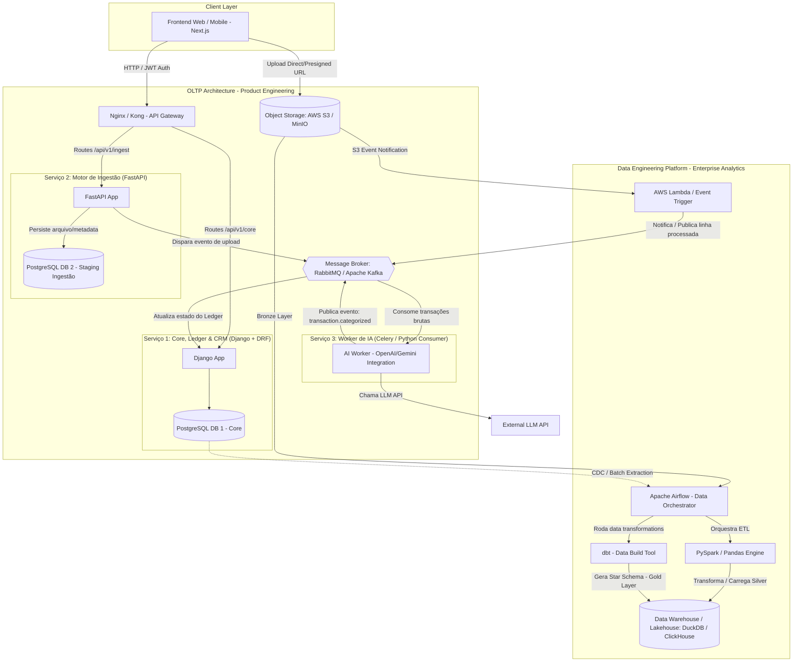

# Arquitetura do Sistema e Plataforma de Dados — Finpy

## 1. Visão Geral do Sistema

O **Finpy** é um ecossistema financeiro distribuído focado no controle de despesas pessoais, divisão de custos (splits) e gestão de saldos devedores (Ledger de Reembolsos). 

O projeto foi desenhado sob os princípios de **Clean Architecture**, **Domain-Driven Design (DDD)**, **Event-Driven Architecture (EDA)** e **Modern Data Stack**, separando rigorosamente o ambiente **OLTP** (Transacional/Aplicação) do ambiente **OLAP** (Analítico/Engenharia de Dados).

---

## 2. Diagrama de Arquitetura Geral



---

## 3. Arquitetura de Microsserviços (OLTP - Engenharia de Software)

### 3.1 Serviço 1: Core, CRM & Ledger de Reembolsos
* **Tecnologia:** Python 3.12+ | **Django 5.x** | **Django REST Framework** | PostgreSQL (DB 1).
* **Responsabilidade:** Domínio principal do negócio, autenticação, controle de acesso, regra de divisão de despesas (Splits), gestão de saldos devedores (Ledger de Reembolsos) e baixa de cobranças (Settlement).
* **Entidades Principais do Domain Driven Design (DDD):**
  * `User` & `Account`: Dados de acesso e contas financeiras do titular.
  * `Contact`: Terceiros cadastrados ou não cadastrados (com quem se divide despesas).
  * `Transaction`: Gastos efetivados/passados.
  * `Split`: Alocação parcial ou total de uma transação a um ou mais `Contacts`.
  * `LedgerEntry`: Razão contábil de partidas dobradas ou controle de saldos por devedor.
  * `Settlement`: Registro de liquidação/baixa manual de dívida (ex: PIX recebido).
* **Design Pattern Especial:** **Double-Entry Ledger Pattern** para garantir auditabilidade completa de "quem deve quanto para quem" com rastreabilidade da transação de origem.

### 3.2 Serviço 2: Motor de Ingestão de Extratos
* **Tecnologia:** Python 3.12+ | **FastAPI** | **SQLAlchemy** | **Pydantic v2** | PostgreSQL (DB 2).
* **Responsabilidade:** Recebimento assíncrono e de altíssima performance de extratos bancários (formatos `.csv` e `.ofx`).
* **Fluxo de Ingestão:**
  1. Recebe arquivo ou envia URL pré-assinada para upload direto no S3.
  2. Validação estrutural do arquivo e sanitização do payload com Pydantic.
  3. Salva a requisição de upload em estado `PENDING` no DB 2.
  4. Publica mensagem no Broker (`statement.uploaded`) contendo o `file_path` e `correlation_id`.

### 3.3 Serviço 3: Worker de IA (Categorização e Enriquecimento)
* **Tecnologia:** Python 3.12+ | **Celery** / Consumer Nativo | Integradores LLM (OpenAI / Gemini SDK).
* **Responsabilidade:** Classificação inteligente e não-bloqueante das descrições brutas de extratos.
* **Fluxo do Worker:**
  1. Consome mensagens da fila `statement.process`.
  2. Executa parsing streaming do arquivo no S3.
  3. Envia o texto da transação para o LLM com técnicas de Few-Shot Prompting e Structured Outputs (JSON Schema).
  4. Publica evento `transaction.categorized` com a categoria e confiança do modelo.
  5. Emite evento para o Serviço 1 persistir no Ledger do Usuário.

---

## 4. Mensageria, Comunicação Assíncrona e Eventos

* **Message Broker:** **RabbitMQ** (ou **Apache Kafka** em cenário de alto throughput de streaming).
* **Formato de Mensagem:** JSON com Pydantic Contracts e versionamento de schema.
* **Tópicos e Queues de Eventos:**
  * `finpy.statements.uploaded`: Disparado quando um extrato é recebido.
  * `finpy.transactions.raw`: Linhas do extrato prontas para categorização.
  * `finpy.transactions.categorized`: Transações classificadas pela IA.
  * `finpy.debts.split_created`: Disparado quando uma transação é dividida com um terceiro.
  * `finpy.debts.settled`: Disparado quando ocorre a baixa de uma dívida.

---

## 5. Plataforma de Engenharia de Dados (OLAP - Enterprise Analytics)

Para a empresa fictícia que comercializa o Finpy, a plataforma de dados extrai valor analítico das operações do produto.

### 5.1 Arquitetura Medallion (Data Lakehouse)

1. **Camada Bronze (Raw Data):**
   * Armazena os arquivos de extratos `.csv`/`.ofx` brutos em buckets AWS S3/MinIO.
   * Contém réplicas brutas e dumps CDC (Change Data Capture) das tabelas do PostgreSQL.
2. **Camada Silver (Cleansed & Conformed):**
   * Processamento via **PySpark** e **Airflow**.
   * Normalização de datas, tratamento de caracteres especiais, remoção de duplicatas (idempotência) e mascaramento de dados sensíveis (LGPD/PII).
3. **Camada Gold (Business & Analytics - Star Schema):**
   * Modelagem dimensional via **dbt (Data Build Tool)** rodando sobre **DuckDB / ClickHouse / Snowflake**.
   * Estruturada em Modelos de Fatos e Dimensões:
     * `dim_users`: Perfil demográfico e plano do usuário.
     * `dim_contacts`: Terceiros devedores cadastrados/não cadastrados.
     * `dim_categories`: Taxonomia de despesas.
     * `fact_transactions`: Todas as transações financeiras processadas.
     * `fact_splits`: Histórico de divisões de contas.
     * `fact_settlements`: Histórico e tempo médio de liquidação de reembolsos.

### 5.2 Casos de Uso Práticos de Engenharia de Dados

* **Airflow DAGs:**
  * `dag_daily_balance_consolidation`: Consolida o saldo diário acumulado de todos os usuários às 02h.
  * `dag_fx_rate_ingestion`: Consome a API do Banco Central para atualizar cotações de moedas.
  * `dag_churn_risk_detection`: Avalia inatividade de usuários baseada no volume de uploads de extrato.
* **AWS Lambda / Event-Driven Ingestion:**
  * Upload no S3 dispara uma função Lambda que valida a hash do arquivo (evitando reprocessamento de extratos duplicados) e grava metadados na camada Bronze.

---

## 6. Observabilidade, Rastreabilidade e Resiliência

* **Correlation ID (Distributed Tracing):**
  * Toda requisição iniciada na API de Ingestão recebe o cabeçalho `X-Correlation-ID` (UUIDv4).
  * O Correlation ID é repassado para as mensagens do RabbitMQ/Kafka, mantido nos logs do Worker de IA e gravado nos bancos de dados, permitindo rastrear o fluxo ponta a ponta.
* **Structured Logging:** Logs formatados em JSON contendo `timestamp`, `level`, `service_name`, `correlation_id` e `user_id`.
* **Métricas & Dashboards:**
  * **Prometheus:** Coleta métricas de latência HTTP, tamanho da fila no RabbitMQ, taxa de sucesso de chamadas à API da IA e tempo de execução das DAGs do Airflow.
  * **Grafana:** Painel consolidado para monitoramento de saúde do ecossistema.

---

## 7. Estrutura do Repositório e CI/CD

### 7.1 Estrutura Monorepo Multi-package

```text
finpy/
├── apps/
│   ├── core-crm/              # Servicio 1: Django + DRF
│   ├── ingestion-service/     # Serviço 2: FastAPI
│   └── ai-worker/             # Serviço 3: Worker Celery/Python
├── data-platform/
│   ├── airflow/               # DAGs e plugins do Apache Airflow
│   ├── dbt/                   # Projetos dbt (models, tests, docs)
│   ├── spark/                 # Scripts PySpark de processamento Batch/Stream
│   └── lambdas/               # Funções Serverless AWS Lambda
├── packages/
│   ├── shared-contracts/      # Schemas Pydantic / Avro compartilhados
│   └── logger/                # Configurações de logs estruturados e correlation ID
├── docker-compose.yml         # Ambiente local completo
├── docker-compose.override.yml
└── .github/
    └── workflows/
        └── ci-cd.yml          # Pipelines de teste, lint e build
```

### 7.2 Esteira de CI/CD (GitHub Actions)

* **Etapa 1: Quality & Linting:** `flake8`, `black`, `isort`, `mypy`.
* **Etapa 2: Automated Testing:**
  * Pytest para Serviço 2 e Serviço 3 (com mocks para RabbitMQ e LLM APIs via `pytest-mock`).
  * Django Test Suite para Serviço 1 (testes de regras do Ledger e Splits).
  * `dbt test` para validação de integridade dos dados na camada Gold.
* **Etapa 3: Build & Containerization:** Build de imagens Docker otimizadas (Multi-stage builds) e publicação no Container Registry.
